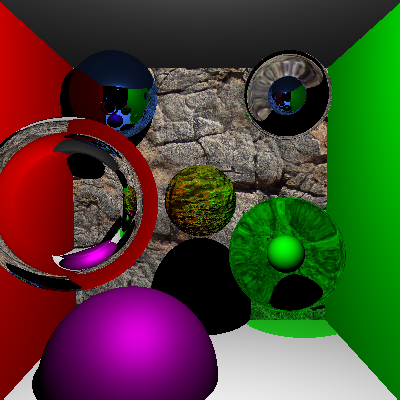
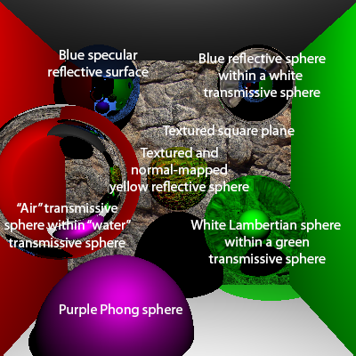
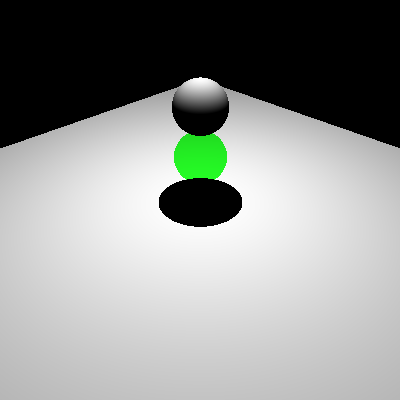
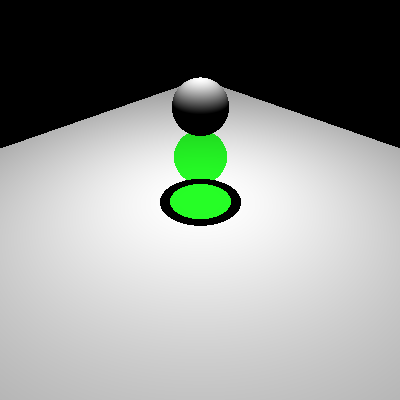
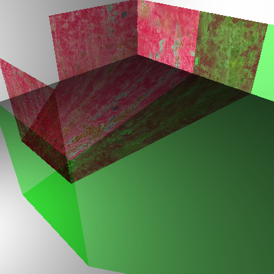
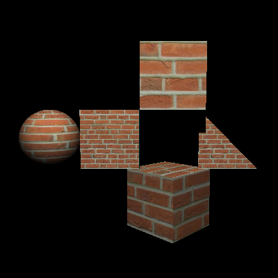

Ray Tracer Part II
======================

**University of Pennsylvania, CIS 561: Advanced Computer Graphics, Homework 2**

Overview
------------
You will continue to program the ray tracer you wrote for the previous homework
assignment by implementing _recursive_ ray traces to compute the light reflected
by mirrored surfaces and the light transmitted by transparent surfaces.
Additionally, you will add some code to make your ray tracer execute on multiple
CPU cores at once to speed its render time.

__You should copy your code from homework 1 into the
repository you clone for this assignment.__

Phong Material (10 points)
-------------------------
Implement the body of
`PhongMaterial::EvaluateReflectedEnergy` such that it returns the color that
a surface with that material would reflect given a particular point of
intersection and incoming light vector. Phong surfaces are similar to Lambertian
surfaces, but they reflect additional light in the form of a glossy specular
highlight. You may set the color of the highlight to be white or the base color
of the material.

Specular Reflection (20 points)
--------
Within each `EvaluateReflectedEnergy` function, add code that recursively calls
`Integrator::TraceRay` to evaluate the energy reflected by materials with a
`reflectivity` that is greater than zero. When `reflectivity` is between zero
and one, the material's final reflected energy should be a linear interpolation
of the material's basic reflection (e.g. Lambertian or Phong) and the material's
specular reflection:
`totalEnergy = (1-refl) * basicReflectedEnergy + refl * specularReflectedEnergy`
. Additionally, the color obtained from the reflected ray should be multiplied
by the material's base color regardless of reflectivity interpolation. Note
that you may have to alter the function signature of
`EvaluateReflectedEnergy` to allow you to call `TraceRay` from within.

Specular Transmission (35 points)
-------------------
If a `Material` has non-zero indices of refraction (`refract_idx_in` and
  `refract_idx_out`), then it should be treated as a specular transmissive
  surface. Rather than returning a value for _reflected_ energy from
  `EvaluateReflectedEnergy`, a transmissive material should return a color for
  light that has been _refracted and transmitted_ through the surface. If a
  transmissive material also has a non-zero `reflectivity`, then it should
  interpolate the specular mirrored color and the specular refracted color based
  on `reflectivity`. Note that this treatment of transmissive materials
  is not particularly physically accurate and is more an exercise in
  understanding how to refract rays through surfaces than it is in realistic
  rendering.

A few elements of ray traced refraction that are important to keep in mind are:
* As noted in `material.h`, the two indices of refraction of a material are to
be used in different cases. `refract_idx_in` should be used as the coefficient
denominator when a ray is entering a surface, and `refract_idx_out` should be
used as the denominator when a ray is leaving a surface.
* The location of the origin of your refracted ray (when should it be inside and
  when should it be outside your surface?)
* Total internal reflection: When a ray leaves a medium and enters a less dense
medium, it may be reflected back into the object it is leaving rather than being
refracted outwards. Make sure you test if this should occur using the critical
angle formula, and reflect the ray instead of refracting it if this is indeed
the case.

Shadows Cast by Transmissive Objects (15 points)
-------------------
A ray tracer is not capable of representing the caustic set of light rays that
are refracted and concentrated by transmissive surfaces. This concentration of
light beams is what causes transmissive objects to cast shadows in the first
place. In order to have transparent objects cast some sort of shadow, we are
going to simply multiply their material's base color by the color reflected by
surfaces shadowed by the transmissive surface. If a transmissive surface has a
texture applied to it, then the color of the texture at the point the shadow
feeler ray intersects will be used instead.

Texture Mapping (20 points)
---------------------
Add the following function declaration to the `Geometry` class:
`virtual glm::vec2 GetUVCoordinates(const glm::vec3 &point) const = 0;`.
For each of the classes that inherit from `Geometry`, provide an implementation
of this function:
* `Sphere` should map from 3D space to 2D space using polar coordinates.
* `Cube` should map each of its faces to a different portion of a unit square
using whatever distribution you prefer.
* `SquarePlane` should map its lower-left corner to UV coordinates (0, 0)
and its upper-right corner to (1, 1).
* `Triangle` should use barycentric interpolation to interpolate the UV
coordinates defined for each of its three vertices by the OBJ file from which
it was loaded.

You should multiply the color obtained from the texture map by these UV
coordinates with the base color of an object's material in each implementation
of `EvaluateReflectedEnergy`.

Testing your results
---------------------
Below are some example renders of the provided scene files with all features
implemented. In some cases, normal mapping (extra credit) may also have been
applied. We have also provided labeled versions of these images to help you
interpret them.

Results of rendering `transparent_containing_objects.json`

Correct result of rendering `transparent_shadow_test.json`:     Incorrect result of rendering `transparent_shadow_test.json`:

Result of rendering `stained_glass.json`:

Result of rendering `all_shapes.json`:

Extra Credit (30 points max.)
-----------
#### Soft Shadows (Up to 15 points)
For scenes containing light sources that have `SquarePlane` geometry, implement
at least one method for sampling random points on the surface of the square
light source to compute the shadows it would cast. If you implement more than
one method, please upload renders of each and compare the quality of the
shadows. If you implement one sampling method, you will earn 9 points. Each
additional method beyond the first can earn you up to 3 additional points.

#### Normal Mapping (15 points)
Implement tangent-space normal mapping on surfaces using the images we provided
you in the `scene_files` folder of the previous homework assignment.

#### "Realistic" Shadows for Transmissive Surfaces (8 points)
A ray tracer is not capable of realistically representing the shadows cast by
transmissive surfaces, but it is possible to fake them. Rather than just
multiplying the base color of the transparent surface with the color of the
surface(s) it shadows, additionally darken the shaded surfaces based on how far
a shadow feeler ray would have traveled within the transparent object before
being refracted back out; the __less far__ a ray travels, the darker the shadow.
This method results in nicer looking shadows cast by transparent objects, but is
in no way based in physical reality.

Submitting your project
--------------
Along with your project code, make sure that you fill out the `README.md` file
with your name, PennKey, extra credit implemented, and __most importantly__,
renders of the provided scene files. Please add sections at the top of this file
to hold this information.

Rather than uploading a zip file to Canvas, you will simply submit a link to
the committed version of your code you wish us to grade. If you click on the
__Commits__ tab of your repository on Github, you will be brought to a list of
commits you've made. Simply click on the one you wish for us to grade, then copy
and paste the URL of the page into the Canvas submission form.
